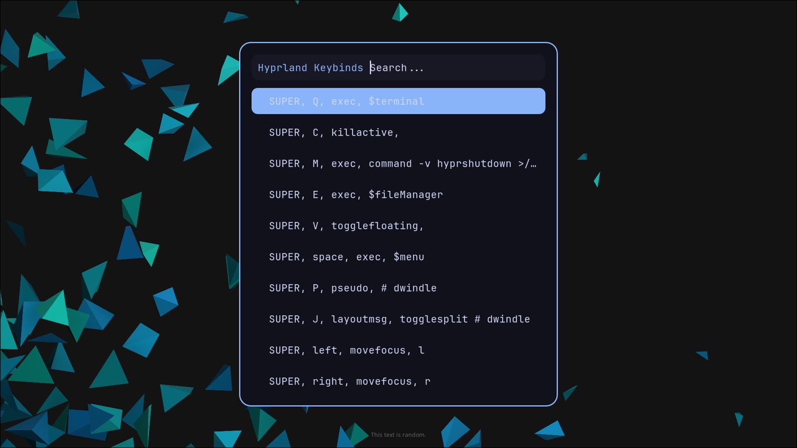

# hyprbinds

Minimal Rofi-powered keybind cheatsheet for Hyprland.

Automatically parses your `hyprland.conf` and displays all keybinds in a clean searchable popup.



---

## Features

- Reads binds directly from `hyprland.conf`
- No duplicated configuration files
- Lightweight and fast
- Rofi-based UI
- Easy to customize
- Minimal aesthetic that fits Hyprland setups

---

# Installation

## Dependencies

Install:

```bash
sudo pacman -S rofi
```

---

## hyprbinds

```bash
curl -fsS https://raw.githubusercontent.com/boterop/hyprbinds/refs/heads/main/install.sh | sh
```

This will:

- Create the scripts directory if needed
- Copy the script
- Add the keybind automatically
- Reload Hyprland

---

# Manual Installation

Create the scripts directory:

```bash
mkdir -p ~/.config/hypr/scripts
```

Copy the script and theme:

```bash
cp hyprbinds.sh ~/.config/hypr/scripts/
cp theme.rasi ~/.config/hypr/scripts/
chmod +x ~/.config/hypr/scripts/hyprbinds.sh
```

Add this bind to your `hyprland.conf`:

```ini
bind = $mainMod, K, exec, ~/.config/hypr/scripts/hyprbinds.sh
```

Reload Hyprland:

```bash
hyprctl reload
```

---

# Customization

Edit:

```bash
~/.config/hypr/scripts/theme.rasi
```

to customize the appearance.
